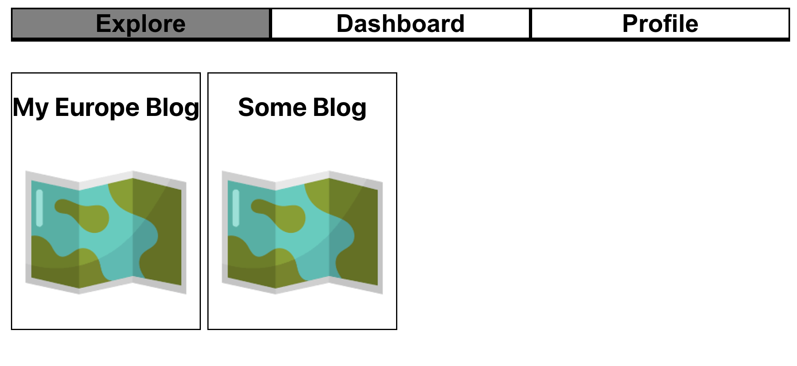

# Follow Me
Follow Me is a MERN-stack web application. It's a blog hosting concept, that would aloow users to create a blog and blog posts. These posts would be visible both in a standard format and a map based format using google maps api with points on a map.

The idea would be the to show the link to friends and family about you trip, nad then can read/see all about it on the map.

[Click here to my planning on Trello](https://trello.com/b/BrLnDt14/followme)

# Technologies

# Languages

# Some Screenshots

# Getting Started
[Click here to try for yourself](https://follow-me-tcb.herokuapp.com/explore)

# Future of the Project
Generally this project is not in the state I wish it were in, but at the time of this as it took me longer than expected to work on certain CRUD aspects of the application. I plan on fixing up the project ASAP or redoing it in it's entirety because I like the concept. Here are some other features I think would be interesting:

- Letting users customize how their blog would be viewed/the layout of the elements. Similiar to a wordpress/squarespace
- Being able to click a marked location on the map to view the post
- Allowing the user to search for a location using the places google api
- Implemented a custom map and icons
- Show ways of transportation between points
- Having full CRUD
